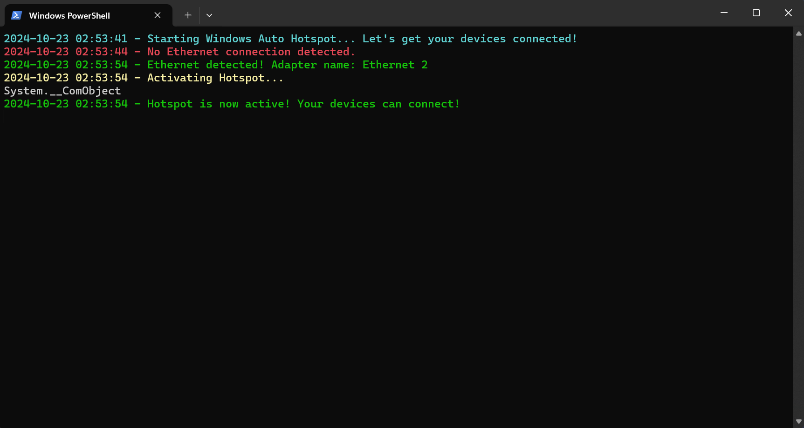
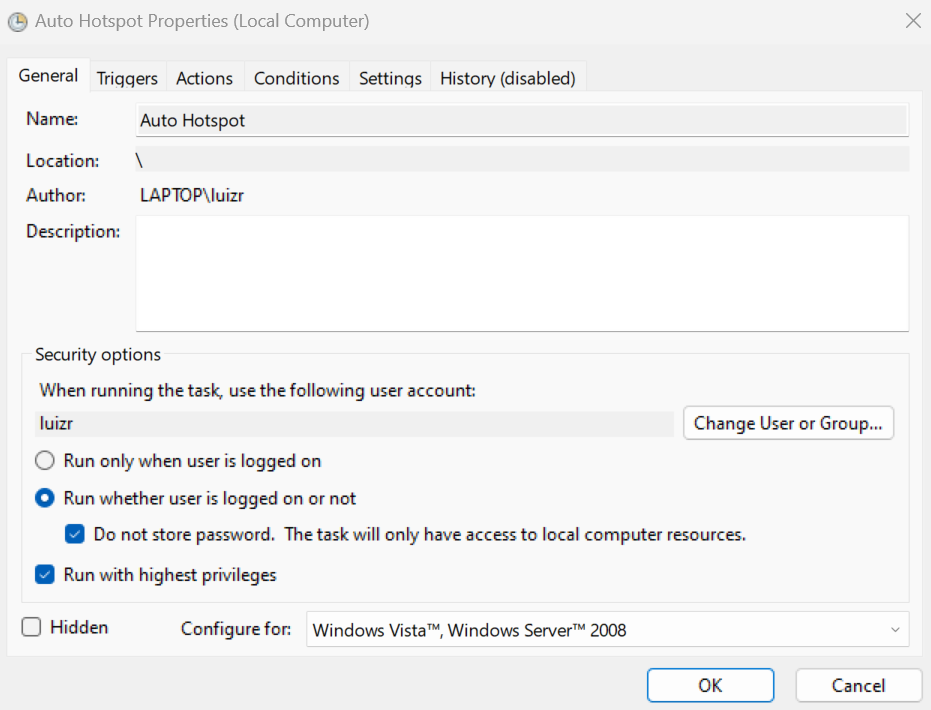
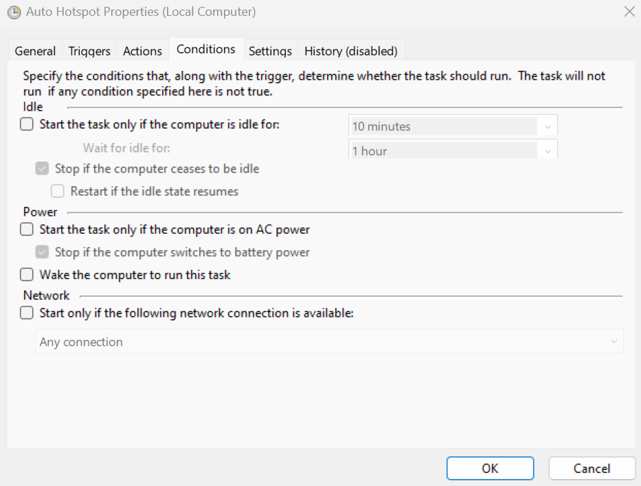
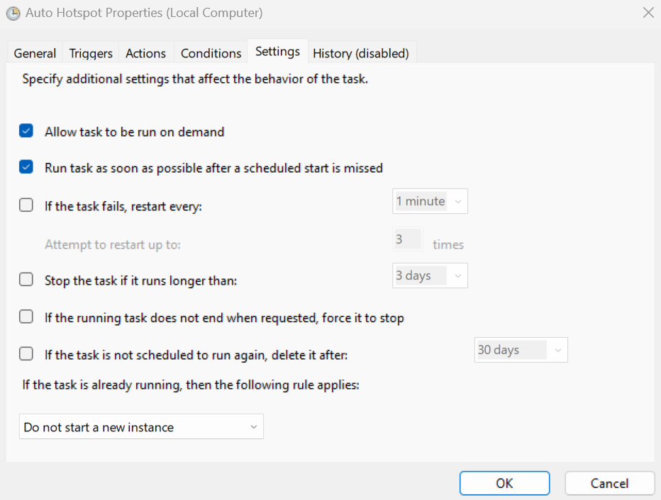

# Windows Auto Hotspot 🪟🛜

**Windows Auto Hotspot** is a PowerShell script that automatically manages your PC's **Wi-Fi hotspot**. It enables the hotspot when an Ethernet cable is connected (including via USB adapters) and disables it when disconnected. Follow the steps below to configure and automate the process using **Task Scheduler**.

### How Does It Work? 🤔

**Windows Auto Hotspot** automates the process of turning your PC into a Wi-Fi hotspot whenever an Ethernet cable is connected. The script runs in the background, activating the hotspot when a wired connection is detected, and disabling it when the cable is unplugged. This eliminates the need for manual management—it's all done automatically.

   <div align="center">
      
   </div>

---

### Why Ethernet? 🌐

This script works exclusively with Ethernet connections. It is designed for environments where your primary internet access is through a wired connection, ensuring seamless sharing via your PC’s Wi-Fi.
### Perfect for Laptop Users 💻

Laptop users will find this script especially useful. If you prefer to close your laptop lid and still keep the hotspot running, you can adjust your system settings to ensure the laptop doesn't go into sleep mode while plugged into power. This allows the hotspot to continue operating even when the lid is closed, making it an ideal solution for keeping your devices connected without interruptions.

For example, you can configure your laptop to stay awake when connected to power, allowing you to use it as a permanent hotspot while keeping it out of the way—no need to keep the screen open or active.

### Key Advantages 🔑
- **Fully Automated**: The script starts automatically with the system and activates the hotspot when an Ethernet cable is detected.
- **Ethernet-Exclusive**: It only works with Ethernet connections, perfect for homes and offices that rely on wired internet.
- **Optimized for Laptops**: You can close your laptop lid without putting it to sleep, allowing the hotspot to keep running while plugged into power.
- **Continuous Monitoring**: Runs silently in the background and adjusts the hotspot as needed.

Whether you're working in an Ethernet-only environment, need a reliable and automated hotspot solution for your laptop, or just want to ensure all your devices stay connected, **Windows Auto Hotspot** is the perfect solution.

---

## Requirements ✅

- *Windows* 10 or higher.
- *Administrator privileges* to run the PowerShell script.
- A PC with an *Ethernet adapter*, either built-in or via *USB Ethernet adapter*, and a *Wi-Fi adapter*.

## Step-by-Step Instructions 🖥️

### 1. Configure Your Wi-Fi Hotspot

Before using the script, you need to manually configure your Wi-Fi hotspot settings on Windows:

1. **Open Hotspot Settings**:
   - Go to **Settings > Network & Internet > Mobile Hotspot**.

   <br>

   <div align="center">
      
   </div>

   <br>

2. **Set the SSID and Password**:
   - Choose your **Network Name (SSID)** and **Password**.

   <br>

   <div align="center">
      
   </div>

   <br>

3. **Select the Connection Type**:
   - If your device supports it, select between **2.4GHz** and **5GHz** for your Wi-Fi hotspot.
4. **Enable Internet Sharing**:
   - Set **Share my Internet connection** to **Wi-Fi**.

Once your hotspot is configured, you can move on to the next steps.

### 2. Download and Place the Script

1. Download the **Windows Auto Hotspot** script from this repository.
2. Place the script in a directory of your choice. It is recommended to save it in your **user's folder** (e.g., `C:\\Users\\YourUser\\Documents`) or any easily accessible folder.

### 3. Set Up Task Scheduler

Now, let's automate the script using **Task Scheduler**:

1. **Open Task Scheduler**:
   - Search for **Task Scheduler** in the Windows Start menu and open it.

   <br>

   <div align="center">
      
   </div>

   <br>

2. **Create a New Task**:
   - Click on **Create Task** in the right sidebar.
   - Name the task something like "Windows Auto Hotspot".
   - Check **Run whether user is logged on or not** and **Do not store password**.
   - Check **Run with highest privileges**.

   <br>

   <div align="center">
      
   </div>

   <br>

### 4. Configure the Triggers

1. **Create a Trigger**:
   - Go to the **Triggers** tab and click **New**.
   - Set **Begin the task** to **At startup**.
   - Under **Advanced settings**, check **Repeat task every** 5 minutes, and set the duration to **Indefinitely**.
   - Make sure the **Enabled** box is checked.

   <br>

   <div align="center">
      
   </div>

   <br>

### 5. Configure the Actions

1. **Set Action to Start PowerShell**:
   - Go to the **Actions** tab and click **New**.
   - Set **Action** to **Start a program**.
   - In the **Program/script** field, enter:

     ```bash
     powershell.exe
     ```

   - In the **Add arguments** field, enter:

     ```bash
     -ExecutionPolicy Bypass -File "C:\\path_to_script\\windows_auto_hotspot.ps1"
     ```

     Replace `"C:\\path_to_script\\windows_auto_hotspot.ps1"` with the actual path where you saved the script.

   <br>

   <div align="center">
      
   </div>

   <br>

### 6. Configure Conditions and Settings

1. **Conditions**:
   - Uncheck everything in the **Conditions** tab (nothing should be enabled).

   <br>

   <div align="center">
      
   </div>

   <br>

2. **Settings**:
   - In the **Settings** tab, check the following options:
     - **Allow task to be run on demand**.
     - **Run task as soon as possible after a scheduled start is missed**.
     - **Do not start a new instance**.

   <br>

   <div align="center">
      
   </div>

   <br>

### 7. Done! 🎉

Your script is now set up to run at startup and will check to enable or disable the hotspot based only on the Ethernet connection status.

If you found this script helpful, feel free to ⭐ star the repository or fork it for your own customization!

---

## License 📄

This project is licensed under the [PolyForm Noncommercial License 1.0.0](./LICENSE).

Commercial use, resale, and paid services are not permitted.
