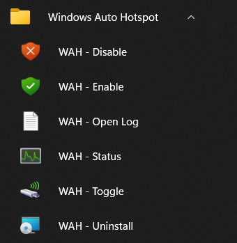

# Windows Auto Hotspot 🪟🛜

**Windows Auto Hotspot** makes your PC share internet automatically.

When your **Ethernet cable is connected**, it turns the Windows **Mobile Hotspot ON**.  
When the cable is disconnected, it turns the hotspot **OFF**.

It is made for normal users, with simple shortcuts in the **Start Menu**. No Task Scheduler setup is needed.

## Who is this for

- People who use **Ethernet** on a PC or laptop
- People who want to share internet to phone, tablet, VR headset, or another device
- People who want it to work automatically after installing

## Install (One-Line)

Open **PowerShell as Administrator** and run:

```powershell
$u='https://raw.githubusercontent.com/luizbizzio/windows-auto-hotspot/main/windows_auto_hotspot.ps1'; $p=Join-Path $env:TEMP 'windows_auto_hotspot.ps1'; Invoke-WebRequest -Uri $u -OutFile $p; & powershell -NoProfile -ExecutionPolicy Bypass -File $p -Install -SourceUrl $u
```

When Windows asks for permission, click **Yes**.

## What you get after installing

After installation, you will find a **Windows Auto Hotspot** folder in the **Start Menu** with shortcuts like:

- **WAH - Disable**
- **WAH - Enable**
- **WAH - Open Log**
- **WAH - Status**
- **WAH - Toggle**
- **WAH - Uninstall**

This makes it easy to use without typing commands.

<p align="center">
  
</p>

## Before you install (one-time Windows setup)

Configure your hotspot once in Windows:

1. Open **Settings**
2. Go to **Network & Internet**
3. Open **Mobile hotspot**
4. Set your **network name (SSID)** and **password**
5. Make sure sharing is set to **Wi-Fi**

After this, the app can manage it automatically.

## How to use (easy mode)

After installing, open the **Start Menu** and use the shortcuts:

- **WAH - Enable**: turns automation on
- **WAH - Disable**: turns automation off
- **WAH - Toggle**: switches between enabled and disabled
- **WAH - Status**: shows Ethernet, hotspot, and task status
- **WAH - Open Log**: opens the log file
- **WAH - Uninstall**: removes everything

## How it works (simple)

- Ethernet connected → hotspot turns **ON**
- Ethernet disconnected → hotspot turns **OFF**
- It keeps monitoring in the background
- It starts automatically when you log in

## Requirements

- **Windows 10 or Windows 11**
- **Administrator permission** (for install/uninstall)
- A **Wi-Fi adapter**
- An **Ethernet connection** (built-in or USB Ethernet adapter)

## Good to know

- This is best for **Ethernet to Wi-Fi sharing**
- Great for **laptops**, including setups where the laptop stays plugged in
- You can use **WAH - Status** anytime to check if everything is working

## Uninstall

Use **WAH - Uninstall** from the Start Menu.

It removes the scheduled task, shortcuts, installed files, and app state.

## License

This project is licensed under the [Apache 2.0 License](./LICENSE).
